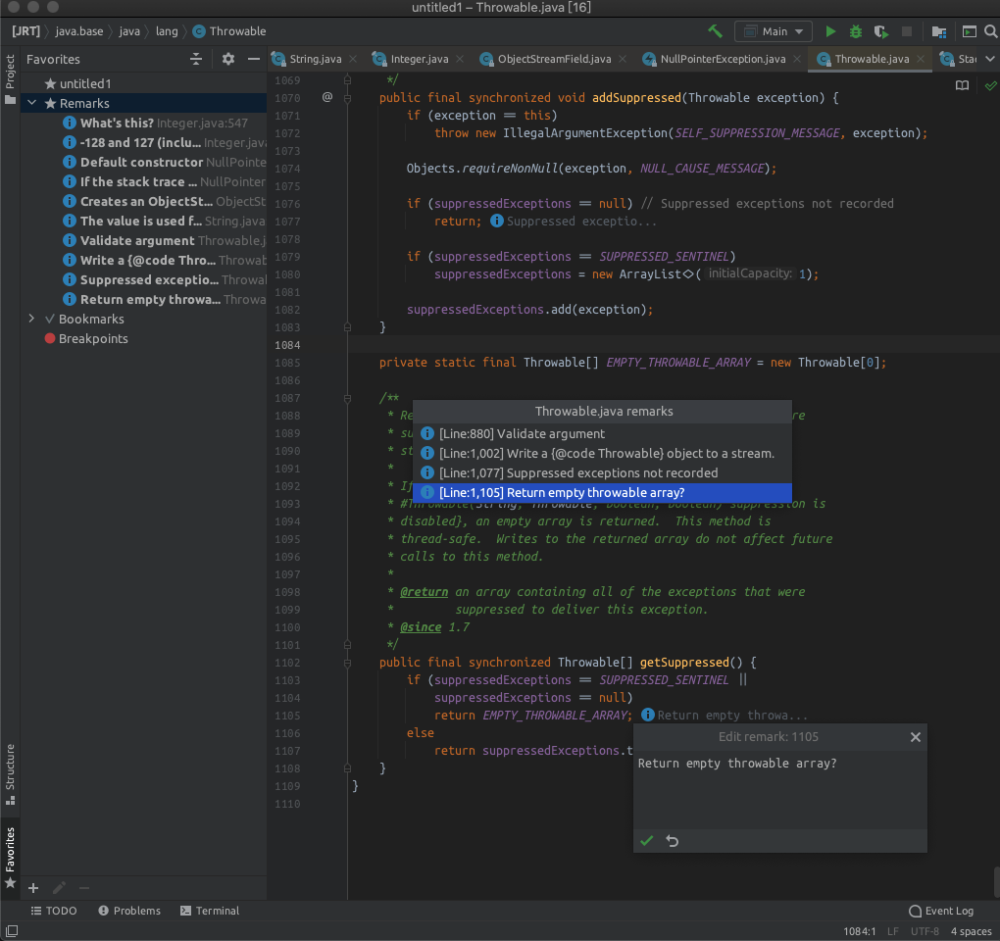
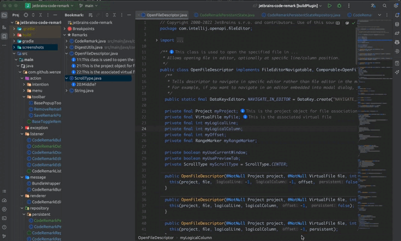

# Jetbrains Code Remark

> A Jetbrains IDE code remark plug-in, different from code comments, it can be applied to read-only source files.

[中文](./README_CN.md) | [Report Issues](https://github.com/wenzewoo/jetbrains-code-remark/issues)

# EXAMPLE

# HOW TO INSTALL

- Search for `Code Remark` in the IDE plug-in market
  [https://plugins.jetbrains.com/plugin/17805-code-remark](https://plugins.jetbrains.com/plugin/17805-code-remark)

- Or download the installation package via [releases](https://github.com/wenzewoo/jetbrains-code-remark/releases) and
  install it manually.

# INSTRUCTIONS FOR USE

The source code is a read-only file, how to add remarks?

- Use IDEA to open the source code file.

- Wherever you need it, you can choose one of the following three ways to trigger the Popup pop-up layer and add
  content.

    - `Alt` + `ENTER` ->  `[MARK] Add/Edit remark` [RECOMMEND]
    - `EditorPopupMenu` / `Tools` ->  `Add remark`

- Use the right-click menu `Remark Navigation` in the editor to preview all the remarks added in the current file.

- In the `View` -> `Tool Windows` -> `Bookmarks` -> `Remarks` view, view all the remarks of the current project.

# HOT KEY

- Add / Edit：<`Alt` + `ENTER`> -> `[MARK] Add/Edit remark` [RECOMMEND]
- Saving：<`shift` + `ENTER`>
- Delete：<`shift` + `DETELE`>
- Cancel：<`ESC`>

> You can search for `remark` through `Preferences`-`Keymap`, and configure the corresponding shortcut keys for the
> specified operation

# How to synchronize with Git repository?

The relevant file is located at `${yourProject}/.idea/code-remark.xml`. Add it to the Git version control repository to
synchronize the code comments.