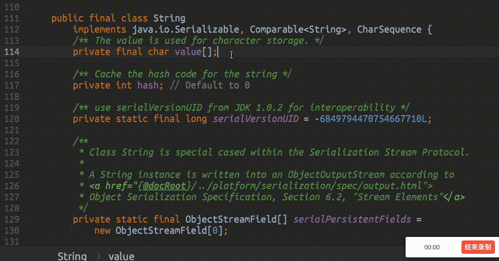

# Jetbrains Code Remark

> 一款Jetbrains系IDE代码备注插件，不同于代码注释，它可被应用于只读的源码文件，让你在阅读源码时如虎添翼。

# 如何安装

在IDE插件市场搜索`Code Remark`或直接下载`Release包`进行手动安装。

# 使用说明

源码是只读文件，如何添加备注？使用该插件让你在阅读框架源码时如虎添翼。

- 1，进入需要阅读的源码文件。

- 2，在任何需要的地方，按下 `Alt + Enter` 快捷键。

- 3，选择 `[MARK] Add Code Mark`，输入备注信息，按下 `Esc` 按钮保存即可。

- 4，已经有备注的行，你依然可以继续按下 `Alt + Enter` 快捷键，选择对应的选项，进行编辑或者删除。